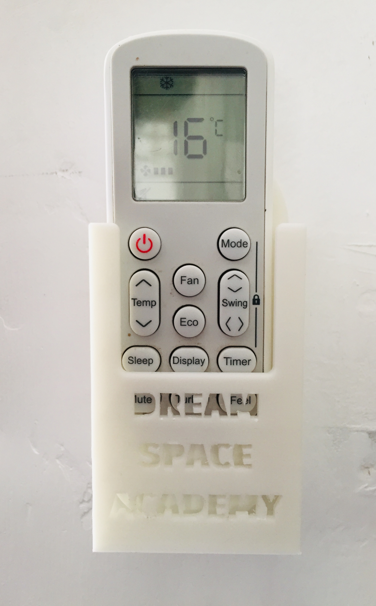
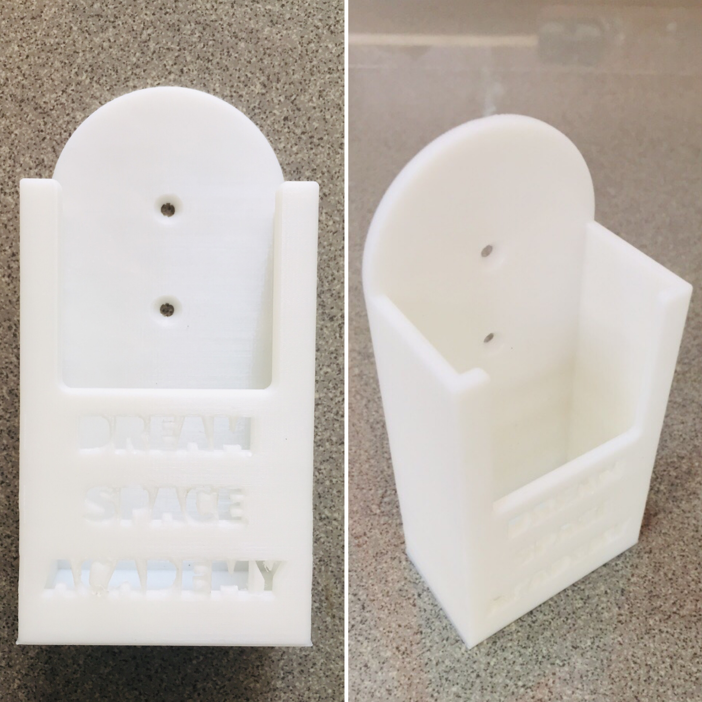

# Airconditioner remote holder case - 3D Model

This is a common problem that we face in daily life. We often need to find the remote when switching on the air conditioner. 
This holder was created for that issue. We can hold the remote in a permanent and easily accessible place.

This repository contains all of the 3D models and files.

## Authors

- [Jathujan Mahendran](https://www.linkedin.com/in/jathujanmahendran/)-Community Innovator at DreamSpace Academy

## Acknowledgements

 - [Jerushan Sritharan](https://www.linkedin.com/in/jerushan-sritharan-9017011b4) -   Guardian of Electronics Lab, DreamSpace Academy

## Used Software

- 3D model designing - Autodesk Fusion 360
- Slicing process - Ultimaker Cura

## Source

1.[Holder-3D Model - STL file](ac-remote-holder-case-3dmodel/source/3d-files/CE3_ac-remote-case.gcode
)

2.[Holder-3D Model - Gcode file](ac-remote-holder-case-3dmodel/source/3d-files/ac-remote-case-stl.stl)